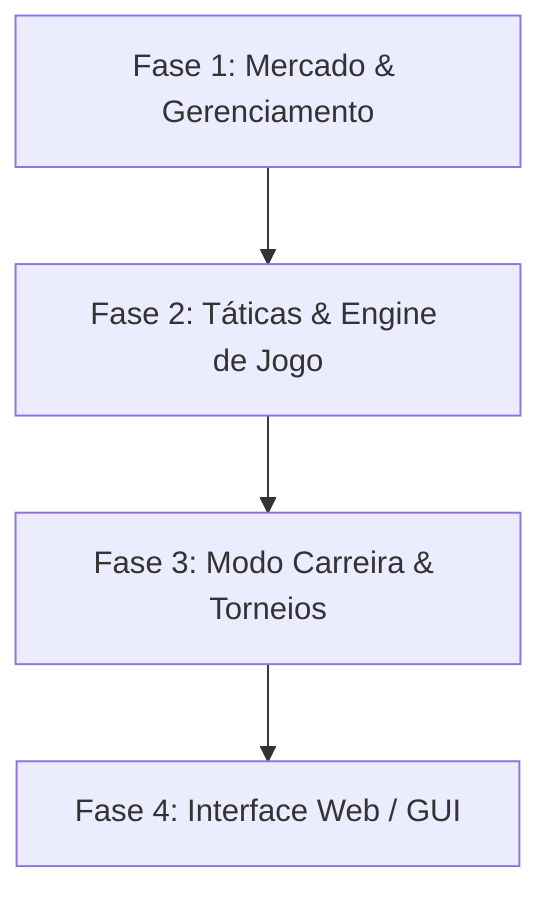

# 🚀 Roadmap do Projeto: Soccer Simulator (Football Manager CLI & Web)

Este documento apresenta a visão de evolução para o **Soccer Simulator**, detalhando as etapas necessárias para transformar o protótipo CLI atual em um simulador de futebol completo, profundo e com uma interface gráfica moderna.

---

## 🗺️ Visão Geral do Roadmap

O desenvolvimento do Soccer Simulator está estruturado em **4 Fases Gerais**:

---

## 🛠️ Fase 1: Mercado & Gerenciamento de Elenco (Curto Prazo)
*Foco: Completar as mecânicas financeiras e de gestão essenciais que estão planejadas ou em formato de placeholder.*

### 🏪 1.1 Mercado de Transferências Completo
- **Compra e Venda:** Implementar a funcionalidade da opção 3 do [CampaignController.ts](file:///c:/Users/Redes/Desktop/soccer/controllers/CampaignController.ts#L272-L278).
- **Lista de Transferências:** Gerar um pool global de jogadores livres ou listados por outros clubes para compra.
- **Negociação de Valores:** Fatores como idade, overall e stamina devem influenciar o valor de mercado final e a aceitação da proposta.
- **Orçamento e Salários:** Integrar o modelo [Economy.ts](file:///c:/Users/Redes/Desktop/soccer/models/Economy.ts) com o custo salarial semanal/mensal do elenco.

### 🤕 1.2 Sistema de Lesões e Fadiga
- **Desgaste Físico:** Jogadores que atuam consecutivamente com stamina baixa aumentam o risco de lesões.
- **Tratamento Médico:** Opção de pagar por departamento médico para acelerar a recuperação de atletas lesionados.
- **Jogabilidade:** Jogadores lesionados ficam indisponíveis para a escalação no [LineupController.ts](file:///c:/Users/Redes/Desktop/soccer/controllers/LineupController.ts).

---

## ⚽ Fase 2: Profundidade Tática & Engine de Jogo (Médio Prazo)
*Foco: Tornar as partidas mais dinâmicas, táticas e interativas.*

### 📋 2.1 Substituições em Tempo Real e Feedback
- **Substituições Durante o Jogo:** Permitir paradas táticas nos "Set Points" da simulação para substituir jogadores cansados ou lesionados.
- **Múltiplas Formações:** Suportar variações táticas clássicas (ex: 4-4-2, 3-5-2, 4-3-3) que alteram os multiplicadores de força ofensiva e defensiva.

### 📊 2.2 Estatísticas de Jogadores e Eventos Detalhados
- **Histórico Individual:** Registrar gols, assistências, cartões amarelos/vermelhos e média de nota (performance) de cada jogador ao longo da temporada.
- **Simulação Verborrágica:** Expandir os eventos de jogo em [MatchController.ts](file:///c:/Users/Redes/Desktop/soccer/controllers/MatchController.ts#L48-L63) para detalhar quem fez o gol, quem deu a assistência e defesas difíceis do goleiro.

---

## 🏆 Fase 3: Expansão do Modo Carreira (Médio-Longo Prazo)
*Foco: Criar um ecossistema persistente e realista de múltiplas temporadas.*

### 👴 3.1 Envelhecimento e Desenvolvimento (Categorias de Base)
- **Evolução Natural:** Jogadores jovens (17-21 anos) ganham overall mais rápido com treinos e jogos.
- **Aposentadoria e Regens:** Jogadores acima de 33 anos perdem overall gradualmente e eventualmente se aposentam, gerando novos talentos jovens correspondentes (regens) para manter a base de dados saudável.
- **Categorias de Base:** Investimento financeiro na captação de novos atletas da base.

### 👑 3.2 Novas Competições
- **Copa Eliminatória (Mata-Mata):** Um torneio paralelo de eliminação direta acontecendo simultaneamente ao campeonato principal de pontos corridos.
- **Premiações e Rebaixamento:** Implementar acesso, rebaixamento e vagas para torneios continentais de elite baseados na tabela de classificação.

---

## 🎨 Fase 4: Transição para Interface Web (Longo Prazo)
*Foco: Mudar da interface baseada em console terminal para uma aplicação web moderna, interativa e visualmente deslumbrante.*

### 💻 4.1 Interface Gráfica Responsiva (Frontend)
- **Painel de Controle (Dashboard):** Tela inicial com gráficos de desempenho financeiro, tabela do campeonato dinâmica e feed de notícias do mundo do futebol.
- **Escalação Visual:** Interface no estilo "drag-and-drop" para definir a formação tática e arrastar os jogadores para o campo de jogo.
- **Simulador de Partida Visual:** Representação visual do campo com o movimento da bola (2D ou representações gráficas estilizadas) e barra de tempo real.

### 🔌 4.2 Stack Tecnológica Proposta para a Fase Web
- **Frontend:** React / Vite com TypeScript para máxima velocidade de desenvolvimento.
- **Estilização:** CSS Vanilla ou TailwindCSS moderno com design futurista (dark mode, glassmorphism e micro-animações dinâmicas).
- **Persistência:** Sincronização do sistema de salvamento físico (`savegame.json`) com o `LocalStorage` do navegador ou banco de dados remoto leve.

---

> [!NOTE]
> A base de testes atual do projeto garante 100% de estabilidade sobre os modelos de regras de negócio. À medida que novas fases do roadmap forem iniciadas, os testes em [controllers](file:///c:/Users/Redes/Desktop/soccer/controllers) e [models](file:///c:/Users/Redes/Desktop/soccer/models) devem ser expandidos para manter o padrão de qualidade.
