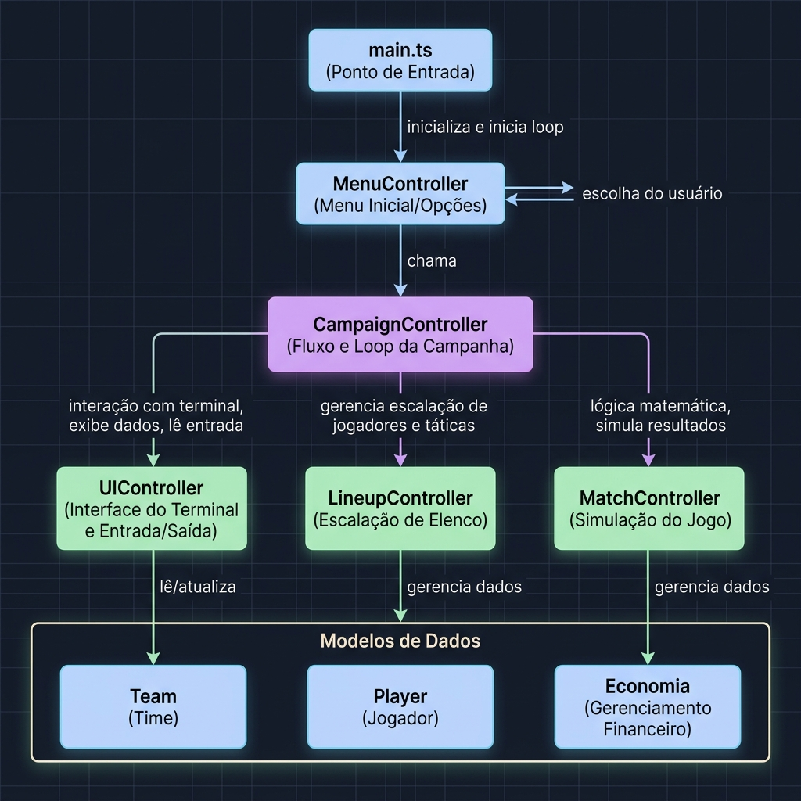
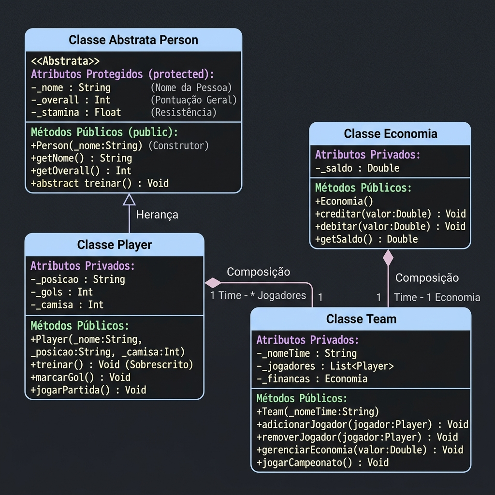

# Guia de Apresentação: POO no Simulador de Futebol (Football Manager 2026)

Este guia descreve detalhadamente a arquitetura do projeto e como os quatro pilares fundamentais da **Programação Orientada a Objetos (POO)** e os princípios do **Clean Code / SOLID** foram aplicados no desenvolvimento deste jogo. Você pode usar este material como roteiro para a sua apresentação ou como material de estudo.

---

## 🏗️ 1. Arquitetura Geral do Projeto

O sistema adota uma separação clara entre **Modelos de Domínio** (que contêm dados e regras de negócio essenciais) e **Controladores** (que orquestram o fluxo da aplicação e a interação com o usuário).

### 📊 Diagrama de Arquitetura do Projeto
Abaixo está o fluxo completo de execução e comunicação entre os controladores e os modelos:



### 📐 Diagrama de Classes (UML)
Abaixo está a estrutura de modelagem das classes e os seus relacionamentos na Programação Orientada a Objetos:



### Arquivos Principais do Projeto
- **Entry Point (Ponto de Entrada):** [main.ts](file:///c:/Users/Redes/Desktop/soccer/main.ts) - Apenas instancia o controlador principal e inicia o jogo.
- **Modelos (Models):**
  - [Person.ts](file:///c:/Users/Redes/Desktop/soccer/models/Person.ts) - Superclasse abstrata de personagens.
  - [Player.ts](file:///c:/Users/Redes/Desktop/soccer/models/Player.ts) - Subclasse de jogador de futebol.
  - [Position.ts](file:///c:/Users/Redes/Desktop/soccer/models/Position.ts) - Enumera as posições táticas permitidas.
  - [Economy.ts](file:///c:/Users/Redes/Desktop/soccer/models/Economy.ts) - Modelo financeiro das equipes.
  - [Team.ts](file:///c:/Users/Redes/Desktop/soccer/models/Team.ts) - Entidade de equipe de futebol.
- **Utilitários e Serviços:**
  - [PlayerGenerator.ts](file:///c:/Users/Redes/Desktop/soccer/util/PlayerGenerator.ts) - Gerador de atributos aleatórios para inicializar elencos.
  - [CampaignSaveService.ts](file:///c:/Users/Redes/Desktop/soccer/services/CampaignSaveService.ts) - Serviço de persistência física dos saves.
- **Controladores (Controllers):**
  - [UIController.ts](file:///c:/Users/Redes/Desktop/soccer/controllers/UIController.ts)
  - [MenuController.ts](file:///c:/Users/Redes/Desktop/soccer/controllers/MenuController.ts)
  - [CampaignController.ts](file:///c:/Users/Redes/Desktop/soccer/controllers/CampaignController.ts)
  - [MatchController.ts](file:///c:/Users/Redes/Desktop/soccer/controllers/MatchController.ts)
  - [LineupController.ts](file:///c:/Users/Redes/Desktop/soccer/controllers/LineupController.ts)

---

## 🔑 2. Aplicação dos Pilares de POO

### A. Abstração (Abstraction)
A **Abstração** consiste em focar nos aspectos essenciais de uma entidade do mundo real, ignorando os detalhes menos relevantes para o contexto do sistema.

- **Onde ocorre:** No arquivo [Person.ts](file:///c:/Users/Redes/Desktop/soccer/models/Person.ts).
- **Como foi aplicado:** A classe [Person](file:///c:/Users/Redes/Desktop/soccer/models/Person.ts) é declarada como `export abstract class Person`. Isso significa que ela serve apenas como um "molde" ou superclasse estrutural. Não é permitido criar uma pessoa genérica diretamente (ex: `new Person()` causa erro de compilação), abstraindo propriedades comuns como nome, idade, stamina, overall e valor de mercado.

### B. Herança (Inheritance)
A **Herança** permite que uma subclasse herde atributos e métodos de uma superclasse, promovendo o reuso de código.

- **Onde ocorre:** No arquivo [Player.ts](file:///c:/Users/Redes/Desktop/soccer/models/Player.ts).
- **Como foi aplicado:** A classe [Player](file:///c:/Users/Redes/Desktop/soccer/models/Player.ts) herda da classe abstrata [Person](file:///c:/Users/Redes/Desktop/soccer/models/Person.ts):
  ```typescript
  export class Player extends Person {
    constructor(...) {
      super(...); // Invoca o construtor da superclasse Person
    }
  }
  ```
  Isso evita a duplicação de getters, setters e campos comuns, herdando a lógica e comportamentos já implementados na classe abstrata.

### C. Encapsulamento (Encapsulation)
O **Encapsulamento** protege o estado interno de um objeto contra acessos diretos e modificações indevidas, expondo apenas métodos públicos controlados.

- **Onde ocorre:** Em todos os modelos, mas com destaque em [Person.ts](file:///c:/Users/Redes/Desktop/soccer/models/Person.ts) e [Economy.ts](file:///c:/Users/Redes/Desktop/soccer/models/Economy.ts).
- **Como foi aplicado:**
  - **Uso de modificadores de acesso:** Atributos marcados como `private` (privados) ou `protected` (protegidos contra acesso externo, permitidos para subclasses).
  - **Métodos Acessores (Getters e Setters) com Validação:**
    - Em [Person.ts](file:///c:/Users/Redes/Desktop/soccer/models/Person.ts):
      ```typescript
      public set overall(value: number) {
        if (value < 1 || value > 100) {
          throw new Error("Overall deve estar entre 1 e 100.");
        }
        this._overall = value;
      }
      ```
      Aqui, o setter garante que nenhuma parte externa defina um overall inválido.
    - Em [Economy.ts](file:///c:/Users/Redes/Desktop/soccer/models/Economy.ts):
      ```typescript
      public debit(amount: number): void {
        if (amount > this._balance) {
          throw new Error("Saldo insuficiente para realizar a transação.");
        }
        this._balance -= amount;
      }
      ```
      Impede que a conta do clube fique com saldo negativo ilegalmente.

### D. Composição / Associação (Composition & Association)
A **Composição** e a **Associação** definem relacionamentos entre classes onde uma classe "tem um" ou "usa" outra.

- **Onde ocorre:** No arquivo [Team.ts](file:///c:/Users/Redes/Desktop/soccer/models/Team.ts).
- **Como foi aplicado:**
  - A classe [Team](file:///c:/Users/Redes/Desktop/soccer/models/Team.ts) possui uma composição com a classe [Player](file:///c:/Users/Redes/Desktop/soccer/models/Player.ts) (um time contém um array de jogadores: `private _players: Player[]`).
  - Possui também composição com a classe [Economy](file:///c:/Users/Redes/Desktop/soccer/models/Economy.ts) (um time contém uma carteira financeira própria: `private _economy: Economy`).
  - O ciclo de vida desses objetos está acoplado: o time orquestra o recálculo dos atributos de seus jogadores coletivamente via `recalculateOveralls()`.

---

## 📐 3. Princípios SOLID e Clean Code Aplicados

Além dos pilares clássicos de POO, o projeto segue práticas modernas de engenharia de software:

1. **Princípio da Responsabilidade Única (SRP - Single Responsibility Principle)**:
   - A geração de atributos randômicos foi removida de classes genéricas de utilidades (antiga `Util` em `PlayersInfos.ts`) e movida para uma classe de finalidade única descritiva: [PlayerGenerator.ts](file:///c:/Users/Redes/Desktop/soccer/util/PlayerGenerator.ts).
   - O controle de exibição de lances e interações do console está isolado no [UIController.ts](file:///c:/Users/Redes/Desktop/soccer/controllers/UIController.ts).
2. **Resolução de Dependências Circulares (Desacoplamento)**:
   - Anteriormente, `Player` importava `Person` e `Person` importava `Position` de dentro de `Player.ts`. Ao extrair o enum para **[Position.ts](file:///c:/Users/Redes/Desktop/soccer/models/Position.ts)**, quebramos esse acoplamento e organizamos o grafo de dependências do compilador de forma linear.
3. **Consistência de Nomenclatura**:
   - Eliminamos a mistura de idiomas (Português/Inglês) no código-fonte através da tradução completa da classe `Economia` para `Economy` e padronização em camelCase (`player.number` e `player.transfer`).

---

## 🛠️ 4. O papel dos Controladores (Controllers)

Os controladores implementam as regras de fluxo do jogo e manipulam as instâncias dos modelos:

1. **[UIController.ts](file:///c:/Users/Redes/Desktop/soccer/controllers/UIController.ts):**
   - Centraliza todas as operações de Entrada e Saída (I/O) no terminal.
   - Gerencia a formatação visual, menus de escolha, telas de carregamento progressivo e animações assíncronas com spinners ASCII.
2. **[MenuController.ts](file:///c:/Users/Redes/Desktop/soccer/controllers/MenuController.ts):**
   - Controla o Menu Principal (Nova Campanha, Carregar, Instruções). Ele decide qual ação tomar com base nas entradas.
3. **[CampaignController.ts](file:///c:/Users/Redes/Desktop/soccer/controllers/CampaignController.ts):**
   - Gerencia o estado de uma campanha (temporada atual, rodada, tabela de pontuação e o loop principal do jogo).
4. **[MatchController.ts](file:///c:/Users/Redes/Desktop/soccer/controllers/MatchController.ts):**
   - Contém toda a lógica matemática para simular os confrontos, aplicar desgaste de stamina (fadiga) nos jogadores, e pagar prêmios financeiros aos times conforme as vitórias ou empates.
5. **[LineupController.ts](file:///c:/Users/Redes/Desktop/soccer/controllers/LineupController.ts):**
   - Responsável pelas táticas e escalação de time dos rivais e do usuário.

---

## 🧪 5. Testes Automatizados (Qualidade de Software)

Todo o comportamento crítico do jogo e as regras dos controladores/modelos estão garantidos por testes unitários automatizados com o framework **Jest**:

* **Modelos**: Validação de clamping de stamina, restrição de saldo de caixa negativo e limites numéricos de overall do jogador.
* **Controladores**: Testes integrados que simulam as rodadas do campeonato, fluxo de carregamento de saves, escolhas táticas de formação e comportamento das telas e animações.
